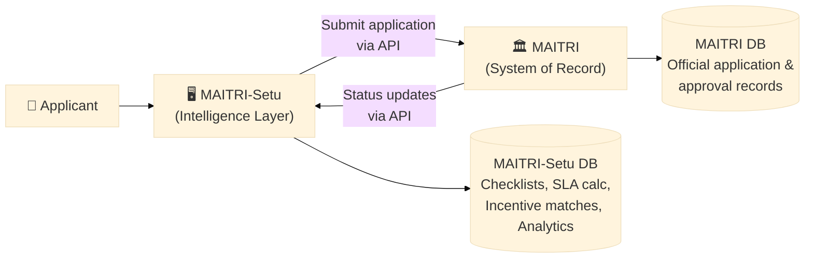
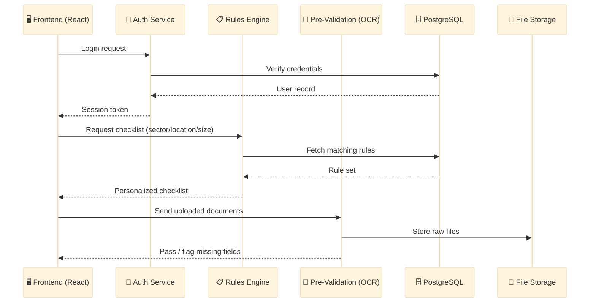
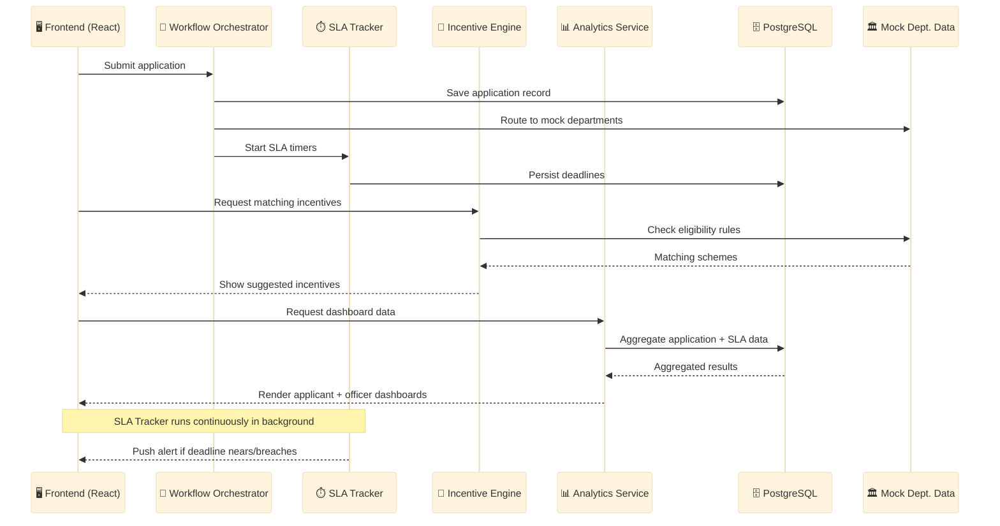
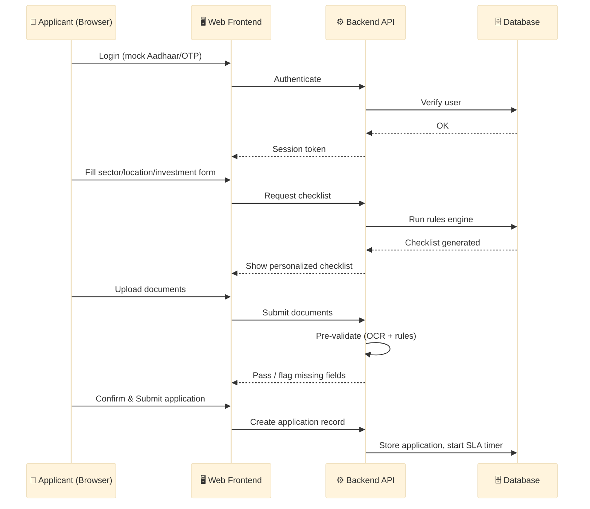
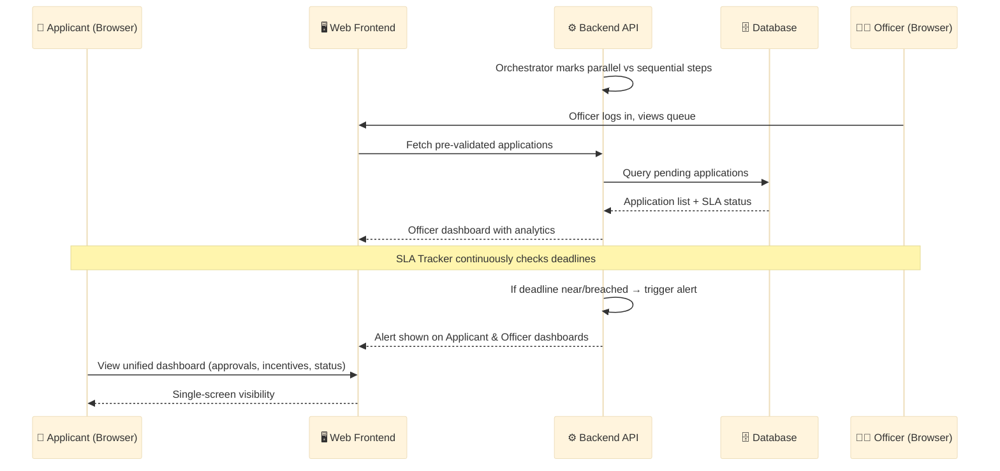

# MAITRI-Setu — Technical Implementation Guide
### For understanding how the prototype is built (all technical)

---

## 1. System Overview

A web-only prototype simulating the MAITRI-Setu intelligence layer, using mocked departmental data (since real MAITRI/MPCB/Fire API access isn't available for a hackathon). Two user roles: **Applicant** and **Officer/Admin**.

---

## 2. MAITRI Integration — How "On Top Of" Actually Works

**Principle:** MAITRI remains the system of record (legal application + approval data). MAITRI-Setu is a system of intelligence that sits in front of and around it. Our database never stores the "official" application — only the extra computed layer (checklists, validation results, SLA calculations, incentive matches, analytics).

### Production integration model


- MAITRI-Setu backend calls MAITRI's departmental APIs to: submit a finalized application, fetch department-wise requirements, poll/receive status updates
- These would be the same APIs MAITRI already uses internally to route applications to departments (Industries, MPCB, Fire, Labour, Electricity)
- MAITRI-Setu's own tables (see Section 6, Data Model) only hold the intelligence-layer data — the actual legal approval status remains authoritative in MAITRI's system

### Prototype-stage reality (be upfront about this)
We do not have real access to MAITRI's backend APIs for a hackathon build — this requires an official government/API partnership. The prototype therefore:
- Uses a **Mock Department Data** layer (seeded JSON/DB tables) standing in for real MAITRI/MPCB/Fire/Labour responses
- Implements the exact same request/response shape our real integration would use, so swapping mock calls for real API calls later is a drop-in replacement, not a rewrite
- This should be stated explicitly in the demo narration: *"In production this connects via MAITRI's departmental APIs; here we've simulated that layer to demonstrate the intelligence features live."*

### Fallback if MAITRI has no open API
If MAITRI turns out to have no API surface available to integrate with, the same frontend/backend works as a **companion portal**: the applicant completes the guided, pre-validated journey in MAITRI-Setu, and the finalized application is exported/handed off into MAITRI (manually, or via a later-negotiated integration). This still solves the checklist + pre-validation + SLA-guidance problem even without live two-way sync.

---

## 3. Architecture

**In plain terms:** which component talks to which — every time the frontend needs something, it calls a specific backend service, and that service reads/writes the specific data store it owns.

### Part A — Login, Checklist Generation, Document Validation


**In plain English:** Login → Auth Service checks credentials, returns a token. Form submit → Rules Engine looks up matching rules, returns a checklist. Document upload → Pre-Validation runs OCR/format checks and flags anything missing.

### Part B — Submission, Orchestration, SLA Tracking, Incentives, Analytics


**In plain English:** Submit → Orchestrator saves the application, routes it to departments, starts SLA timers. Incentive Engine checks eligibility and returns matching schemes. Analytics pulls dashboard numbers from the database. SLA Tracker watches deadlines in the background and alerts on breach.

---

## 4. Application Flow (User Journey)

### Part A — Applicant Journey


**In plain English:** Applicant logs in → fills a quick form → gets an instant personalized checklist → uploads documents (checked on the spot) → submits, which saves the application and starts the deadline clock.

### Part B — Officer Journey, SLA Escalation & Unified Dashboard


**In plain English:** The system sorts approvals into parallel vs. sequential. Officer logs in and sees only pre-checked applications, plus quick analytics. Deadlines are tracked live — both sides get alerted on a breach. Applicant sees everything (status, incentives, renewals) on one dashboard.

---

## 5. Technology Stack (Free & Open Source Only)

| Layer | Technology | Notes |
|---|---|---|
| Frontend | React.js + Tailwind CSS | SPA, componentized UI |
| Routing | React Router | Client-side routing |
| Backend | Node.js + Express.js | REST API |
| Database | PostgreSQL | Relational, handles structured workflow data |
| ORM | Prisma or Sequelize | Free, simplifies schema + queries |
| OCR | Tesseract.js | Runs in-browser or Node, free |
| Rules Engine | json-rules-engine (npm) | Drives checklist + incentive logic |
| Workflow Queue | BullMQ (Redis-based) | Handles async orchestration |
| SLA Scheduling | node-cron | Periodic deadline checks |
| Charts | Recharts or Chart.js | Officer analytics dashboard |
| File Storage | MinIO (self-hosted, S3-compatible) or local disk | Document storage |
| Auth | JWT (jsonwebtoken npm package) | Mock login for prototype |
| Hosting (prototype) | Vercel/Netlify (frontend) + Render/Railway (backend) | Free tiers |
| Hosting (production concept) | NIC MeghRaj / State Data Centre | No new cost — existing Govt infra |
| Version Control | GitHub | Free |

---

## 6. Data Model (Simplified — for Prototype)

### Core Tables

**users**
```
id (PK), name, email, role (applicant/officer), password_hash, created_at
```

**applications**
```
id (PK), user_id (FK), sector, location, investment_size, stage,
status (draft/submitted/in_review/approved/rejected), created_at, updated_at
```

**approvals** (one application → many approvals, since each needs multiple department clearances)
```
id (PK), application_id (FK), department_name, approval_type,
status (pending/in_progress/approved/rejected),
sla_deadline, is_parallel (boolean), created_at, updated_at
```

**documents**
```
id (PK), approval_id (FK), file_name, file_path, validation_status
(pending/passed/flagged), uploaded_at
```

**incentives**
```
id (PK), scheme_name, eligibility_criteria (JSON), description
```

**application_incentives** (matched incentives per application)
```
id (PK), application_id (FK), incentive_id (FK), matched_at
```

**inspections**
```
id (PK), application_id (FK), departments_involved (array/JSON),
scheduled_date, status
```

---

## 7. API Endpoints (Prototype Scope)

| Method | Endpoint | Purpose |
|---|---|---|
| POST | `/api/auth/login` | Mock login, returns JWT |
| POST | `/api/checklist` | Generate checklist from sector/location/size |
| POST | `/api/applications` | Create new application |
| GET | `/api/applications/:id` | Get application + all approval statuses |
| POST | `/api/applications/:id/documents` | Upload + pre-validate a document |
| POST | `/api/applications/:id/submit` | Submit application, start SLA timers |
| GET | `/api/applications/:id/sla` | Get SLA countdown per approval |
| GET | `/api/incentives/match/:applicationId` | Get matched incentive schemes |
| GET | `/api/inspections/:applicationId` | Get joint inspection suggestion |
| GET | `/api/officer/queue` | List pre-validated applications (officer view) |
| GET | `/api/officer/analytics` | Delay heatmap + bottleneck data |

---

## 8. Folder Structure (Suggested)

```
maitri-setu/
├── frontend/
│   ├── src/
│   │   ├── pages/
│   │   │   ├── Login.jsx
│   │   │   ├── ApplicantDashboard.jsx
│   │   │   ├── ChecklistForm.jsx
│   │   │   ├── DocumentUpload.jsx
│   │   │   └── OfficerDashboard.jsx
│   │   ├── components/
│   │   ├── api/          (API call functions)
│   │   └── App.jsx
│   └── package.json
├── backend/
│   ├── src/
│   │   ├── routes/
│   │   ├── services/
│   │   │   ├── authService.js
│   │   │   ├── rulesEngine.js
│   │   │   ├── preValidation.js
│   │   │   ├── workflowOrchestrator.js
│   │   │   ├── slaTracker.js
│   │   │   ├── incentiveMatcher.js
│   │   │   └── analyticsService.js
│   │   ├── models/       (Prisma/Sequelize schema)
│   │   ├── mockData/     (seed JSON for departments/rules)
│   │   └── server.js
│   └── package.json
└── README.md
```

---

## 9. Deployment Plan (Prototype)

1. Frontend → deploy on **Vercel** (free tier, auto-deploy from GitHub)
2. Backend → deploy on **Render.com** (free tier)
3. Database → **Render PostgreSQL free tier** or **Supabase free tier**
4. File storage → local disk for demo simplicity, or MinIO container if time allows
5. Record demo video using **OBS Studio** (free) once deployed/running locally

---

*This document covers everything technical needed to actually understand how the system is built. See the companion file `04_AI_Build_Instructions.md` for a ready-to-use prompt set to hand to an AI coding agent.*
