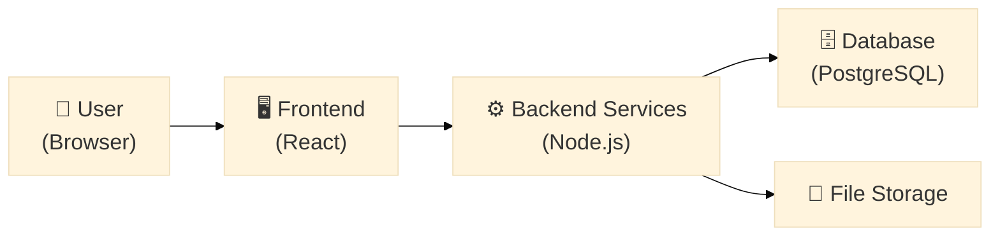

# MAITRI-Setu — High-Level Technical Solution
### Quick technical overview (no code, no schema — just the "how it works" picture)

---

## 1. What It Is, Technically

A web application with two connected parts:
- A **frontend** the applicant/officer sees and clicks through
- A **backend** with a set of small services, each responsible for one job (checking documents, tracking deadlines, matching incentives, etc.)
- A **database** that remembers everything (applications, statuses, deadlines)

---

## 2. How "On Top of MAITRI" Actually Works

- **MAITRI stays in charge** — it's still the official system where the legal approval happens. We don't replace it.
- **We only add the smart layer** — our database stores the checklist logic, validation results, SLA calculations, and incentive matches. The actual application record stays with MAITRI.
- **In production**, MAITRI-Setu would call MAITRI's own departmental APIs to submit applications and check status — the same way MAITRI already routes applications internally.
- **For this prototype**, we don't have real access to those APIs (no team would, without an official government partnership), so we use realistic mock data to simulate exactly how that connection would behave.
- **If no API ever becomes available**, MAITRI-Setu can still work as a companion tool — guiding and pre-validating the application, then handing the final version to MAITRI.

---

## 3. The Building Blocks (Backend Services)

| Service | Job in one line |
|---|---|
| Auth Service | Logs the user in |
| Rules Engine | Generates the personalized approval checklist |
| Pre-Validation Service | Checks uploaded documents for errors instantly |
| Workflow Orchestrator | Decides which approvals can run at the same time |
| SLA Tracker | Watches every deadline and raises alerts |
| Incentive Matching Engine | Suggests government schemes the applicant qualifies for |
| Analytics Service | Turns raw data into charts for the officer dashboard |

Each service does **one job only** — this keeps the system simple to build, test, and explain in a demo.

---

## 4. How Data Moves (Simplified)

**In plain English:** The user only ever interacts with the frontend. The frontend calls whichever backend service is relevant to the action (login, checklist, upload, submit). Each service reads or writes only the data it needs.

---

## 5. The User Journey (High Level)

1. **Login** → identity confirmed
2. **Answer a short form** (sector, location, size) → get a personalized checklist instantly
3. **Upload documents** → checked immediately, errors flagged before submission
4. **Submit** → independent approvals processed in parallel, not one-by-one
5. **Track progress** → single dashboard shows every approval's status and deadline
6. **Get alerted** → if any deadline is close or missed
7. **See matched incentives** → relevant schemes suggested automatically
8. **Officer side** → sees only pre-checked, ready-to-review applications, plus simple analytics

---

## 6. Tech Stack (One Line Each)

| Layer | Tool | Why |
|---|---|---|
| Frontend | React.js | Fast, component-based, free |
| Styling | Tailwind CSS | Clean UI, no design overhead |
| Backend | Node.js + Express | Lightweight, widely supported, free |
| Database | PostgreSQL | Reliable, free, handles structured data well |
| Document Checking | Tesseract.js | Free OCR, no paid API needed |
| Rules Logic | json-rules-engine | Simple rule-based decisions, no ML complexity needed |
| Hosting | Free tiers (Vercel/Render) for prototype; Govt cloud (MeghRaj) for production | Zero to low cost |

**Everything used is free and open-source — no licensing costs, no paid APIs.**

---

## 7. Why This Design Works for a Prototype

- **Small, single-purpose services** → easy to build one at a time, easy to demo one at a time
- **Mocked department data** → no dependency on getting real government API access before the deadline
- **Web-only** → one codebase, no separate mobile app needed
- **Free stack top to bottom** → nothing blocks development due to cost or paid trials

---

*For full technical detail — database schema, API endpoint list, folder structure, deployment steps — see `03a_Technical_Implementation_FullDepth.md`.*
